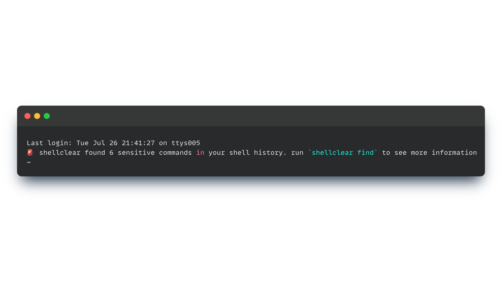
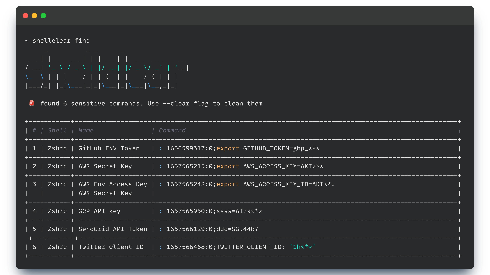

[](https://github.com/rusty-ferris-club/shellclear/actions/workflows/build.yml)

<p align="center">
<br/>
<br/>
<br/>
   
<br/>
<br/>
</p>
<p align="center">
<br/>
<b>:triangular_flag_on_post: Show sensitive command summary when open a new terminal</b>
<br/>
<b>:eyes: Clear sensitive commands from shell history</b>
<br/>
<b>:see_no_evil: Stash your history command before presentations OR screen sharing</b>
<br/>
<hr/>
</p>

# Shellclear

The idea behind `shellclear` is to provide a simple and fast way to secure you shell commands history


<details>
<summary>macOS</summary>

```sh
curl -sS https://raw.githubusercontent.com/rusty-ferris-club/shellclear/main/install/install.sh | bash
```

Or via brew
```sh
brew tap rusty-ferris-club/tap && brew install shellclear
```

</details>

<details>
<summary>Linux</summary>

You need to make sure that `apt install xz-utils` is install. There is an open issue [#52](https://github.com/rusty-ferris-club/shellclear/issues/52) to remove this dependencies.
```sh
curl -sS https://raw.githubusercontent.com/rusty-ferris-club/shellclear/main/install/install.sh | sh
```

</details>

<details>
<summary>Windows</summary>

```sh
iwr https://raw.githubusercontent.com/rusty-ferris-club/shellclear/main/install/install.ps1 -useb | iex
```

</details>

Or download the binary file from [releases](https://github.com/rusty-ferris-club/shellclear/releases) page.

</details>

## Setup your shell

<details>
<summary>Bash</summary>
Add the following to the end of ~/.bashrc:

```sh
eval $(shellclear --init-shell)
```
</details>

<details>
<summary>Zsh</summary>
Add the following to the end of ~/.zshrc:

```sh
eval $(shellclear --init-shell)
```
</details>

<details>
<summary>PowerShell</summary>
Add the following to the end of your PowerShell configuration (find it by running $PROFILE):

```powershell
Invoke-Expression (&shellclear --init-shell)
```
</details>

<details>
<summary>Fish</summary>
Add the following to the end of ~/.config/fish/config.fish:

```sh
shellclear --init-shell | source
```
</details>




## Using

```sh
$ shellclear --help

Secure shell commands

USAGE:
    shellclear [OPTIONS] [SUBCOMMAND]

OPTIONS:
        --config-dir <CFG_DIR_PATH>    Set configuration directory path
    -h, --help                         Print help information
        --init-shell                   Show sensitive findings summary for MOTD
        --log <LEVEL>                  Set logging level [default: INFO] [possible values: OFF,
                                       TRACE, DEBUG, INFO, WARN, ERROR]
        --no-banner                    Don't show the banner
    -V, --version                      Print version information


SUBCOMMANDS:
    config     Create custom configuration
    find       Find sensitive commands
    help       Print this message or the help of the given subcommand(s)
    restore    Restore backup history file
    stash      Stash history file
```

## :eyes: Find Sensitive Commands

Sensitive data can be stored in your history file when export a token of something or running a script with token.

```sh
shellclear find --format table
```



### :broom: Clear findings :

```sh
shellclear clear
```

## :luggage: Backup shell history before clear

```sh
shellclear clear --backup
```

## :see_no_evil: Stash/Pop/Restore

You can stash your history shell by running the command:

```sh
shellclear stash
```

Now your history shell is clear, to bring back your history run the command:

```sh
shellclear stash pop
```

You can also restore your history backup file by running the command:

```sh
shellclear stash restore
```

## :pencil2: External Configuration

Create custom configuration by running the command

```sh
shellclear config
```

Config command will create:

1. Custom pattern template for adding a custom risky patterns
2. Ignore file to allows you ignore specific pattern

### Validate Config Files

Validate syntax file

```sh
shellclear config validate
```

### Delete Config Folder

Validate syntax file

```sh
shellclear config delete
```

### Ignores Pattern

Manage pattern ignores

```sh
shellclear config ignores
```

# Examples
[All the examples here](./example/README.MD) - you make this happen, thanks!


# Thanks

To all [Contributors](https://github.com/rusty-ferris-club/shellclear/graphs/contributors) - you make this happen, thanks!

# Copyright

Copyright (c) 2022 [@kaplanelad](https://github.com/kaplanelad). See [LICENSE](LICENSE.txt) for further details.
